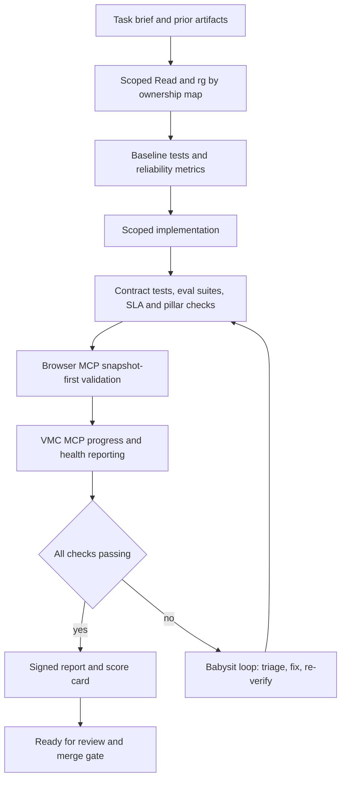

# Autonomous Verifier

Use this skill to replace trial-and-error coding with proof-driven execution.

## When to Use

- Complex features touching multiple files or systems
- Reliability work (dispatch, callbacks, reconciliation, SSE, observability)
- Bug fixes that require reproducible evidence
- Work that depends on external services (SharePoint, DocuSign, DB, browser UI)
- Any VMC Reliability Waterfall phase

## Quick Start Checklist

Copy this checklist and keep it updated while working:

```text
Autonomous Verifier Progress
- [ ] 1) Load phase brief, ownership map, and latest artifacts
- [ ] 2) Read MCP schema files before any CallMcpTool
- [ ] 3) Run baseline verification (tests, lint, typecheck, health checks)
- [ ] 4) Implement scoped changes only
- [ ] 5) Re-run full verification matrix
- [ ] 6) Validate UI/API behavior with browser snapshots and logs
- [ ] 7) Report progress and completion through VMC MCP
- [ ] 8) Write artifact report with metrics, diffs, risks, and rollback notes
- [ ] 9) Run babysit loop until comments triaged and CI green
- [ ] 10) Update tasks/lessons.md and add rule if failure pattern recurs
```

## Verification Loop Architecture



## Required Execution Rules

### 1) Scope and Input Control

1. Read only task-relevant files first.
2. Do not edit outside declared ownership unless explicitly declared in report.
3. Keep one active objective at a time.

### 2) MCP Schema-First Contract

Before any `CallMcpTool` call:

1. Read the MCP tool descriptor JSON.
2. Confirm required arguments and allowed values.
3. Execute the tool with explicit parameters.
4. Persist tool evidence in the phase report.

### 3) Verification Matrix (Must Pass)

Run all applicable checks:

- Contract tests for invariants introduced by the phase
- Unit and integration tests covering touched behavior
- Typecheck and lint for edited code
- Reliability counters (for example callback success, stale todo rate, reconcile lag)
- Browser validation using fresh snapshots after structural actions
- External integration checks (DB/API/SharePoint/DocuSign) in staging context only

Use `.cursor/skills/autonomous-verifier/scripts/validate.sh` for standardized reliability checks.

### 4) Browser Validation Rules

When using `cursor-ide-browser` tools:

1. List tabs before action.
2. Take a fresh snapshot before each structural interaction.
3. Use refs from the latest snapshot, not guessed selectors.
4. After click/fill/type/scroll/navigation, snapshot again before next interaction.
5. Stop after four failed attempts and document blocker with evidence.

### 5) VMC Coordination Rules

Use VMC context tools around each milestone:

- `vmc_get_context` at start and before major decisions
- `vmc_checkout_task` before implementation
- `vmc_report_progress` at logical checkpoints
- `vmc_get_repo_health` and `vmc_get_dependency_risks` before merge gate
- `vmc_complete_task` only after all verification evidence is attached

### 6) CI and Review Correction Loop

Use the `babysit` skill:

1. Triages every comment and CI signal first.
2. Applies small scoped fixes only.
3. Re-runs checks after every fix.
4. Stops only when mergeable, green, and comment-triaged.

### 7) Staging Guard for DB and External Ops

Before DB-affecting commands:

```bash
source ~/.secrets-env.staging
bash scripts/assert-staging-context.sh
```

If the guard fails, stop and fix environment context first.

## Completion Contract

Do not mark done until all are true:

- Verification matrix passes with command evidence
- Browser and API behavior validated with snapshots/logs
- VMC progress/completion calls are recorded
- Phase report includes before/after metrics and residual risks
- `tasks/lessons.md` updated for any failure pattern encountered

## Additional Resources

- Detailed command matrix and report template: [reference.md](reference.md)
- End-to-end usage examples: [examples.md](examples.md)
- Reusable validation script: [scripts/validate.sh](scripts/validate.sh)
