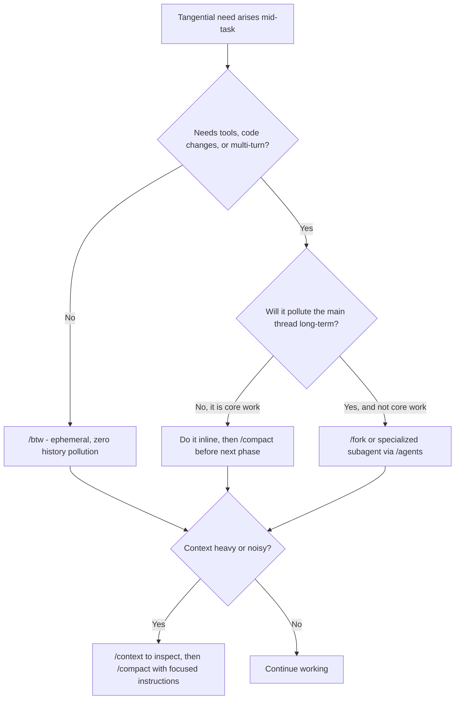

# Context Hygiene & Claude Code Command Orchestrator

Version: 1.0

Turn yourself into a context-aware orchestrator. Long sessions degrade when context
bloats: tokens are wasted, reasoning slows, earlier context gets "forgotten", and cost
climbs. This skill keeps the main thread clean and high-signal by picking the right
context command at the right moment.

**Key Rule:** Prefer prevention (`/btw` + good subagents) over cure (`/compact`). Use
`/compact` proactively with high-quality instructions rather than reactively when context
is already degraded.

## When to Use

- Long autonomous or semi-autonomous coding sessions.
- Context feels heavy, noisy, or token usage is climbing.
- A tangential question, side task, or deep specialized task (tests, security, review) comes up.
- Transitioning between phases of a feature, or recovering from an exploration dead-end.
- The user mentions context, compaction, forking, subagents, rewind, or clearing.

## When NOT to Use

- Short, single-turn tasks where context never grows.
- Work that genuinely needs the full live thread inline (do not isolate core work for its own sake).
- As a substitute for actually doing the task — context hygiene serves the work, not vice versa.

## Quick-Start Checklist

Copy this and keep it updated during a long session:

```text
Context Hygiene Loop
- [ ] Tangential need? Route via the decision framework before answering inline
- [ ] Quick + no tools needed -> /btw (ephemeral)
- [ ] Needs tools/multi-turn or would pollute the thread -> /fork or subagent
- [ ] Deep specialized work (tests/security/review) -> subagent via /agents
- [ ] Before a complex step or phase change -> /context, then /compact with focused instructions
- [ ] Went down a wrong path -> /rewind to a checkpoint
- [ ] Completely unrelated new phase -> capture keepers, then /clear
- [ ] Periodically -> /context to monitor health
```

## Decision Framework

| Situation | Primary | Secondary | Why |
|---|---|---|---|
| Quick clarification / reminder while a task is running | `/btw` | — | Ephemeral, zero history pollution, full context access, no tools |
| Side work needing tools, code changes, or multi-turn | `/fork` | Subagent | Isolated or background execution |
| Context approaching limits or getting noisy | `/compact <instructions>` | — | Controlled summarization with focus |
| Want specialized, reusable behavior (testing, security, review) | Subagent via `/agents` | — | Isolated context + custom prompt + tools |
| Made mistakes or went down a wrong path | `/rewind` | — | Rollback to a checkpoint |
| Completely unrelated new phase | `/clear` | — | Fresh start |
| Monitoring health | `/context` | — | Visibility before acting |

## Command Selection Logic

Two questions decide almost everything:

1. Does this need tools or multi-turn work? **No** -> `/btw`. **Yes** -> consider `/fork` or a subagent.
2. Will it pollute the main thread long-term? **Yes, and it is not core work** -> isolate it (`/fork` or subagent).

Before compaction, always run `/context` first and craft strong instructions.



## When to Use Each Command

- **`/btw`** — Ask an ephemeral, zero-pollution question while a task runs. Full context
  access, no tools, nothing persisted to history. Ideal for quick clarifications and
  reminders. *Fallback:* if `/btw` is unavailable in your Claude Code version (check
  `/help`), approximate it with the briefest possible inline note or a local scratchpad
  you delete afterward — never let a throwaway question bloat the thread.
- **`/compact <instructions>`** — Controlled summarization of the conversation so far.
  Always pass focused instructions; never run it bare. Run `/context` first. Use it
  proactively before complex steps, not reactively once context is already degraded.
- **`/fork`** — Branch the session for isolated side work that needs tools or multiple
  turns, without polluting the main thread. *Fallback:* if unavailable, delegate the same
  work to a subagent.
- **`/agents` + subagents** — Create or select a specialized subagent that runs in an
  isolated context with its own prompt and tools. Best for deep, focused, reusable work.
  See [Subagent Strategy](#subagent-strategy).
- **`/context`** — Inspect token usage and context composition. Run before compacting or
  clearing, and periodically through a long session. Visibility before action.
- **`/rewind`** — Roll back to a previous checkpoint after a mistake or wrong path. Use it
  liberally while exploring or debugging — it is cheaper than reasoning around a polluted thread.
- **`/clear`** — Wipe context for a completely unrelated new phase. Everything is lost, so
  capture anything worth keeping (decisions, file paths, test commands) before running it.

## High-Quality Compaction Instructions

A `/compact` is only as good as its instructions. Never compact blind. Templates:

- **General:** Focus on architecture decisions, key requirements, current goals, and all
  modified file paths. Preserve test commands/results. Drop repetitive debugging and dead-ends.
- **Phase transition:** Summarize previous phase outcomes. Focus on integration points and
  open tasks for the next phase.
- **Post-debugging:** Retain only the final working approach, root cause, and successful
  tests. Remove all failed attempts.

Reusable template:

```text
/compact Focus on: <current goals + invariants>.
Preserve: <files changed, test commands + results, key decisions, open tasks>.
Drop: <failed attempts, repetitive debugging, resolved tangents>.
```

The full library (refactor, research, integration, pre-handoff, and more) lives in
[reference.md](reference.md).

## Subagent Strategy

Delegate deep, focused work to subagents instead of doing it in the main thread — they run
in isolated contexts, so their exploration never pollutes yours.

Delegate when work is: (a) deep and self-contained, (b) reusable across sessions, or
(c) likely to generate lots of intermediate noise (test iterations, security scanning,
broad code review).

Keep a small roster of useful subagents:

- **test-writer** — ships with this skill at [subagents/test-writer.md](subagents/test-writer.md).
  To install it as a local Claude Code subagent, copy it to `.claude/agents/test-writer.md`
  (or create it interactively via `/agents`).
- **code-reviewer** — reuse the existing `.claude/agents/code-reviewer.md` rather than
  defining a new one.
- **security review** — use your environment's existing security-review subagent flow; do
  not hand-roll a duplicate.

Pattern: hand the subagent a crisp objective + scope, let it work in isolation, and bring
back only the result (tests written, findings, review verdict) into the main thread.

## Recommended Workflows

**Long Autonomous Session**
1. Heavy `/btw` usage for quick checks.
2. Proactive `/compact` before each complex step.
3. Delegate reviews and tests to subagents.
4. Periodic `/context` checks to monitor health.

**Feature Development**
1. Plan the feature.
2. Implement.
3. `/btw` for quick questions along the way.
4. Subagent for tests and review.
5. `/compact` (phase-transition template) before the next phase.

**Debugging / Exploration**
1. Use `/rewind` liberally to abandon wrong paths.
2. `/btw` for quick checks without polluting the thread.
3. `/compact` (post-debugging template) after stabilizing on a solution.

## Anti-Patterns to Avoid

- Asking tangential questions directly in the main thread.
- Waiting until context is critically full before compacting.
- Using the main thread for specialized deep work (reviews, testing, research).
- Vague compaction instructions.

## Invocation Examples

- "Keep this long session clean" -> apply the Long Autonomous Session workflow; lead with `/context`.
- "Quick question while that runs" -> `/btw ...` (or the fallback note if unavailable).
- "Context is getting noisy" -> `/context`, then `/compact` with a focused template.
- "Write tests for this module" -> delegate to the test-writer subagent.
- "We went down the wrong path" -> `/rewind` to the last good checkpoint.
- "Starting something unrelated" -> capture keepers, then `/clear`.
- "Summarize before the next phase" -> `/compact` with the phase-transition template.

## Success Metrics

A good application of this skill yields:

- Significantly lower token usage on long sessions.
- Fewer "I forgot earlier context" moments.
- Cleaner, more focused main conversation threads.
- Higher-quality test coverage via subagent delegation.
- Faster recovery from exploration dead-ends (via `/rewind` + `/compact`).

## Additional Resources

- Per-command deep dive, full compaction template library, and command-availability notes: [reference.md](reference.md)
- Before/after worked scenarios for each workflow: [examples.md](examples.md)
- Bundled test-writer subagent definition: [subagents/test-writer.md](subagents/test-writer.md)
